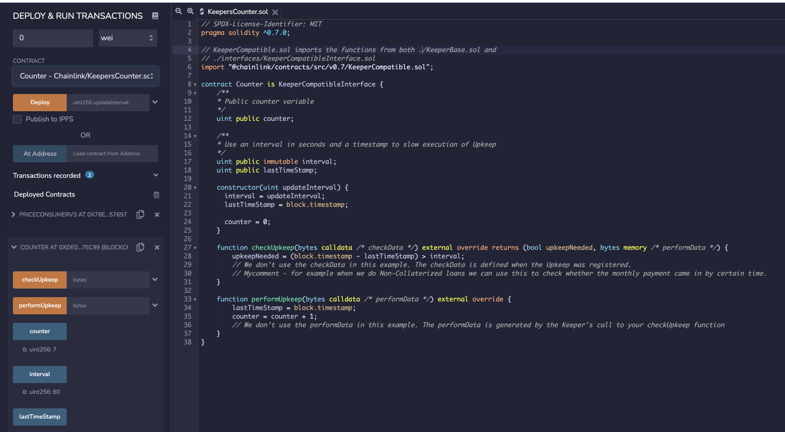
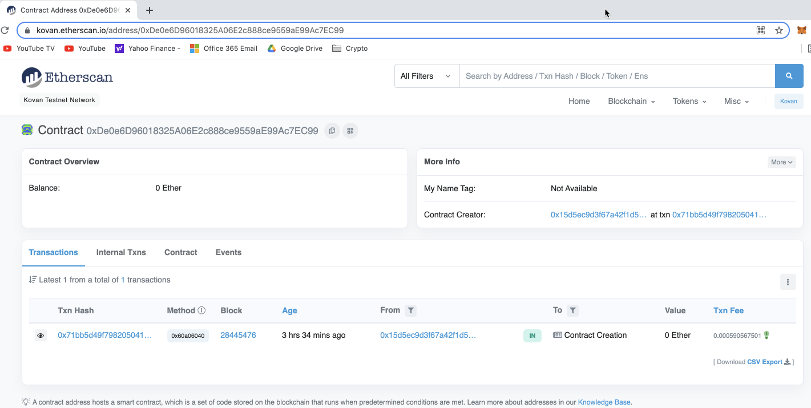
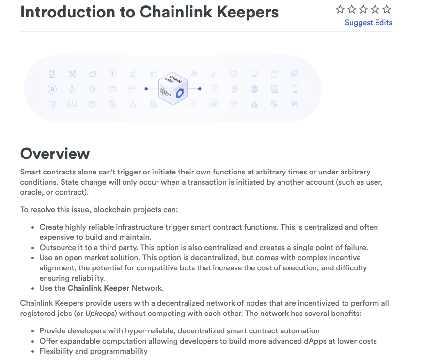

# Chain Link Keepers

## Summary

Implemented Chainlink Keeper into a solidity Smart Contract to have them check every 1 minute execute PerformUpKeep which for now increments a counter.

This concept can for example later be expanded to real world application like check monthly payments made for a DeFi non-collaterized loans for example or a real estate rental contract. 

### function checkUpkeep -  

Tells Time keepers when to do the Perform Upkeep. So its like the condition is met then the UpKeep will be done. There is no need at any time for the Users or developers to call this. Only for the Keepers. They will take this Function and virtualize it on their nodes.  They are going to run it there until the conditions are met. 

calldata is to do any customized each run, pass in this date for upkeep etc. Something to explore later maybe.

This calldata is passed to performUpkeep and can be used. 

### function performUpkeep

performs this function when the condition in CheckUpKeep is met.

Deployed it with Injected Web3 through MetaMask onto the Kovan testnet with 60 secs as the interval for the keeper to do the performUpkeep.

### Smart contract code

https://gist.github.com/rchak007/46a36cddb71d6319ab12bd05780bec1b

### Deployed Contract

https://kovan.etherscan.io/address/0xDe0e6D96018325A06E2c888ce9559aE99Ac7EC99

### Docs

https://docs.chain.link/docs/chainlink-keepers/introduction/

